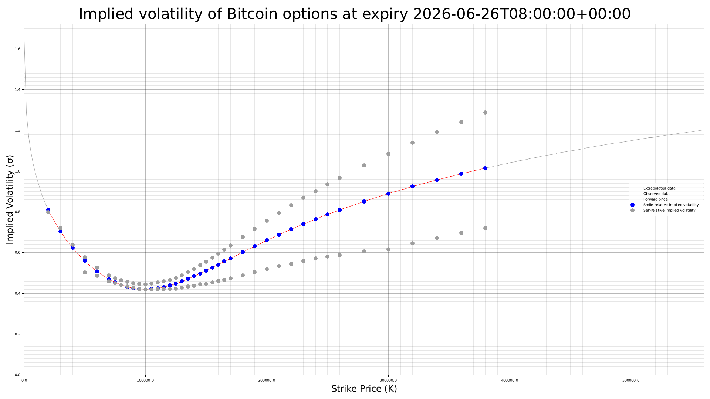

# Theta Surface

Rust tool for fetching Bitcoin option data, fitting the volatility surface and generating graphs showing implied volatility against strike price.

The purpose of this is to demonstrate the implementation of complex market-based mathematics and algorithms in a clear and structured way. It is not necessarily meant to be the fastest or most efficient implementation. For an example of fast low-latency programming, see https://github.com/anthonysharpy/nanofill.

## Graph explanation



- **Extrapolated data**: The extrapolated part of the smile curve.
- **Observed data**: The smile curve representing the range of data that we actually observed.
- **Smile-relative implied volatility**: The implied volatility of an option acccording to the fitted smile curve.
- **Self-relative implied volatility**: The actual implied volatility of an option according to its own data. Basically, this is what the curve is trying to fit. Multiple of these on the same strike usually implies a put/call pair. If these show a trend that differs greatly from the curve, it implies that the curve was badly fit.
- **Forward-price**: The forward price of the asset.

## Maths

Below are some of the formulas used for calculating the graphs.

**SVI parameterisation curve**

$$
w(k) = a + b\left(\rho\,(k-m) + \sqrt{(k-m)^2 + \sigma^2}\right)
$$

where

$$
k = \ln\!\left(\frac{K}{F_T}\right), \qquad w(k) = \sigma_{\text{impl}}^2(k,T)\,T.
$$

Implied volatility from SVI:

$$
\sigma_{\text{impl}}(k,T) = \sqrt{\frac{w(k)}{T}}.
$$

**Black-Scholes implied volatility formula**

Call:

$$
C = S_0 e^{-qT} N(d_1) - K e^{-rT} N(d_2)
$$

Put:

$$
P = K e^{-rT} N(-d_2) - S_0 e^{-qT} N(-d_1)
$$

with

$$
d_1 = \frac{\ln\!\left(\frac{S_0}{K}\right) + \left(r-q+\frac{1}{2}\sigma^2\right)T}{\sigma\sqrt{T}},
\qquad
d_2 = d_1 - \sigma\sqrt{T}.
$$

## Usage

1. Enter the project's root directory.

```
cd theta-surface
```

2. Build the project.

```
cargo build --release
```

3. Download the latest market data. This is semi-optional as the software is packaged with data by default. However, since expired options are discarded, if you don't download fresh data then none of the included data might be useable. It can also cause some graphs to fail to be built. The data takes 5-10 minutes to download and is saved in `/data`.

```
./target/release/ThetaSurface fetch-market-data
```

4. Fit the volatility surface for the downloaded data. This data is also saved in `/data`.

```
./target/release/ThetaSurface build-surface
```

5. Generate graphs showing the implied volatility against strike price for each option expiry. These are saved to `/data/graphs` as .png files.

```
./target/release/ThetaSurface build-graphs
```

## How it works

_**fetch-market-data**_

- Bitcoin option data is downloaded from Deribit's public cryptocurrency API. An option is a contract granting the right to buy or sell an asset (in this case Bitcoin) at a pre-determined price (**strike price**) on a pre-determined date (**expiry**).
- For consistency, we normalise all downloaded data to have the same spot price.
- This data is saved to file.

_**build-surface**_

- The download Deribit data is loaded from file.
- This data is converted into a simpler internal format. Any invalid options are discarded (e.g. options that have already expired).
- These options are then grouped by expiry. Typically, there will be a wide range of options with different strike prices for the same expiry.
- A smile graph is constructed for each group. The smile graph will show how the (implied) volatility of the option changes as the strike price changes, which typically looks like a smile.
- When creating and using the smile graph, we must determine a single forward price for the underlying (Bitcoin) per smile. Since we already normalised spot prices, they are all the same, so we just pick the first one. For consistency, we plug this into the same forward-price formula that we use for solving implied volatility.
- Creating the smile graph ("fitting") involves using a guessing-based algorithm to find the most accurate curve that fits the data.
- First, we use a multi-layered search that starts by roughly scanning the whole likely range of values and then honing in on the area where the optimal solution is found. This provides us starting values for the Levenberg-Marquardt algorithm, which is a form of gradient descent that helps us rapidly converge on the best solution.
- The curve we fit is based on the SVI formula, which is designed to usually produce curves that are valid according to conventional enonomic theory (but not always, so we also manually check for arbitrage).
- Checks for valid bounds and butterfly arbitrage etc. are carried out during fitting in order to ensure an (economically) mathematically valid fit.
- Under the hood, the use of the SVI formula actually produces a graph showing how total implied variance changes as log moneyness changes. This is not actually what we're interested in, but it's required to make the math work. We'll convert this back later.
- The curves for each group are saved to file, as well as some other information about the smile and the options belonging to it that will help us when building the graphs later.

_**build-graphs**_

- The smile graphs for each expiry group are loaded from file.
- Any existing graphs are deleted.
- A graph is constructed for each smile. The first and last quarter of each graph is extrapolated data. The middle half of each graph is in the range of the data that we actually observed from the API, and so is likely the most accurate.
- In creating the graphs some math is performed to convert the smiles from a graph showing the change in total implied variance changes against log moneyness into a graph that shows how implied volatility changes as the strike price changes.
- Once constructed, these graphs are saved to file.
- These graphs are then useful for things such as efficiently pricing options at any given strike price, accurately analysing the market when other data is noisy, validating that other market data is accurate and tracking changes in risk and uncertainty over time.

## Known limitations

- Volatility is shown for calls and puts combined. It's probably more useful to have separate smiles for puts and calls. This can also cause distortions in the graph such that even curves that are "mathematically" optimised appear wrong to the eye. 
- Fitting is pretty fast, but it could be faster. One obvious optimisation would be making it multi-threaded.
- Poor-quality data (e.g. options with weird prices) is not removed, which can negatively affect the overall fit.
- More tests are needed. The basic mathematical pieces like the implied volatility calculations have tests, but there is a lack of tests in other places. This project already took a long time to put together, and I just don't fancy spending days writing tests for it all. Thankfully though the program is mostly self-testing since it displays most things on the graph, which can be checked manually.

## Recent Changes

### 20 Feb 2026
- Replace the patience-based algorithm with a multi-layered grid search algorithm, which is 150x faster.
- Simplify, tidy and optimise code.
- Add defensive assertions and error checking to methods.
- Show time elapsed when fitting graphs.

### 12 Feb 2026
- More careful error handling.

### 2 Feb 2026
- Use a single saved time value instead of constantly fetching the current time, which causes distortions based on how long the program has been running.

### 30 Jan 2026
- Add forward price line to graphs.
- Clarify output on graph build failure to say that stale data can cause graph building failures.

### 27 Jan 2026
- Add improved fitting algorithm based on patience. Derive the `a` value in SVI formula rather than guessing it as testing shows this gives much improved performance and accuracy.
- Fix butterfly arbitrage checks not checking whole graph range. Increase sampling resolution.
- Make fitting patience more aggressive/faster.
- Don't save calculated values to file as they might have been calculated using the current time and we don't want to accidentally use them again in future.
- Don't print average graph error for now since errors are relative per-graph, and so the average is somewhat meaningless.

### 23 Jan 2026
- Add debugging constants.
- Normalise spot prices for all options with the same expiry.

### 22 Jan 2026
- Add points on the graph showing the options.
- Require minimum number of options per graph. Fail to fit graph if not met.
- Retry network failures when downloading API data.
- Optimise SVI by trying different starting values, or we easily get stuck in local minima.